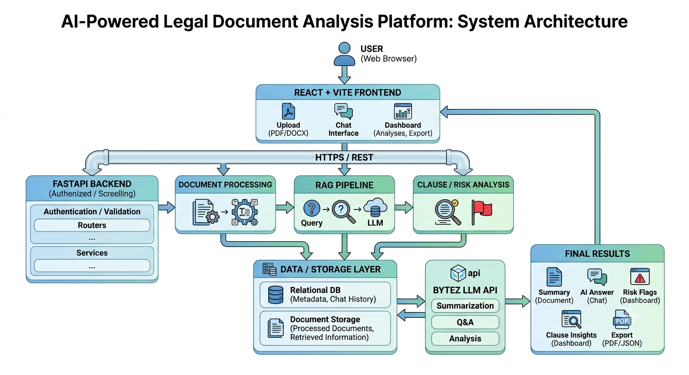

# ⚖️ LegalEase


<p align="center">
  AI-powered legal document analysis platform that simplifies complex legal documents, provides intelligent summaries, and offers chatbot-based assistance.
</p>
🎥 Demo

[▶️ Watch the LegalEase Demo](https://drive.google.com/file/d/1zMrWVhCsbolH060KOvx9M3mFUDJtHxz5/view?usp=sharing)

## 🎯 Why LegalEase?

Legal documents are often difficult for ordinary users to understand because of legal jargon and lengthy clauses.

LegalEase helps users by:

- Simplifying complex legal language
- Generating concise summaries
- Highlighting risks and important clauses
- Providing AI-powered legal assistance
- Improving accessibility and understanding

# LegalEase Website

A comprehensive legal document analysis platform that combines AI-powered document processing, chatbot assistance, and user-friendly interfaces.

## System Architecture




## Project Structure

```
LEGAL EASE
├── .github/
│   └── workflows/
│       ├── ci.yml
│       ├── gssoc-auto-label.yml
│       ├── gssoc-ci.yml
│       ├── gssoc-stale.yml
│       ├── gssoc-welcome.yml
│       ├── pr-test.yml
│       └── test.yml
│
├── assets/
│
├── backend/
│   ├── core/
│   ├── data/
│   ├── middleware/
│   ├── routers/
│   │   ├── auth_routes.py
│   │   └── legal_routes.py
│   ├── services/
│   │   ├── ai_service.py
│   │   └── legal_mapping.py
│   ├── tests/
│   │   ├── conftest.py
│   │   ├── test_ai_pipeline.py
│   │   ├── test_api_validation.py
│   │   ├── test_endpoints.py
│   │   ├── test_integration.py
│   │   ├── test_legal_mapping.py
│   │   ├── test_rate_limiter.py
│   │   └── test_security.py
│   ├── utils/
│   ├── auth.py
│   ├── database.py
│   ├── main.py
│   ├── models.py
│   ├── requirements.txt
│   └── pytest.ini
│
├── coverage/
├── docs/
│   └── tailwind-theme-guide.md
├── htmlcov/
├── legacy/
│
├── public/
│
├── src/
│   ├── components/
│   │   ├── BackToTop.tsx
│   │   ├── ErrorBoundary.tsx
│   │   ├── Footer.tsx
│   │   ├── Header.tsx
│   │   ├── LegalMapping.tsx
│   │   ├── ProtectedRoute.tsx
│   │   ├── ScrollToTop.tsx
│   │   ├── ShareButton.tsx
│   │   ├── Toast.tsx
│   │   ├── ToastContainer.tsx
│   │   └── WhatsAppShareModal.tsx
│   ├── config/
│   ├── contexts/
│   ├── hooks/
│   ├── layouts/
│   ├── pages/
│   ├── services/
│   ├── test/
│   ├── App.tsx
│   ├── main.tsx
│   └── index.css
│
├── .env.example
├── .eslintrc.json
├── .gitignore
├── CODE_OF_CONDUCT.md
├── CONTRIBUTING.md
├── LICENSE
├── package.json
├── pnpm-lock.yaml
├── pnpm-workspace.yaml
├── postcss.config.js
├── README.md
├── tailwind.config.js
├── tsconfig.json
├── vite.config.ts
└── vercel.json
```

## Features

### 🏠 Home Page (`HomePage.tsx`)
- **Hero Section**: Compelling introduction with call-to-action buttons
- **Features Overview**: Document summary, jargon explanations, and risk alerts
- **Quick Actions**: Direct access to main features
- **Security Information**: Trust indicators and compliance details
- **Responsive Design**: Mobile-friendly layout

### 📊 Dashboard (`DashboardPage.tsx`)
- **Statistics Overview**: Document counts, processing status, and time saved
- **Quick Actions**: Fast access to upload, chat, and processing
- **Recent Activity**: Timeline of user actions
- **Recent Documents**: Latest uploaded files with status indicators

### 📄 Document Upload (`DocumentsPage.tsx`)
- **Drag & Drop Interface**: Intuitive file upload experience
- **File Validation**: Type and size checking (PDF, DOCX, TXT up to 25MB)
- **Feature Explanation**: Clear description of AI capabilities
- **Recent Documents**: History with processing status

### 🤖 AI Chatbot (`ChatbotPage.tsx`)
- **Interactive Chat Interface**: Real-time conversation with AI
- **Legal Topics Sidebar**: Quick access to common questions
- **Message History**: Persistent conversation log
- **Legal Disclaimer**: Important usage guidelines

### ⚙️ Processing Status (`ProcessingPage.tsx`)
- **Real-time Progress**: Step-by-step processing visualization
- **Animated Progress Bars**: Visual feedback for each stage
- **Processing History**: Past document processing records
- **Status Management**: Cancel, retry, and download options

### 📄 PDF Export Feature
- **API Endpoint**: `POST /api/export/pdf`
- **Interactive Button Integration**: Add "Export PDF" button to pages showcasing AI summaries (document details modal in vault, pipeline completion screen) and chatbot conversation transcripts.
- **Loading & State Handling**: Disables buttons and shows a visual spinner during PDF generation.
- **Secure Architecture**: Enforces token-based API authentication and server-side text sanitization.
- **Professional Formatting**: Employs backend `reportlab` layout structure containing dynamic header metadata, running dividers, structured user vs AI dialogue tags, and A4 automatic page numbers ("Page X of Y").

### 📊 Readability Score Analyzer (`ReadabilityScore.tsx`)
- **Dual Comparison**: Computes and contrasts readability metrics for the original legal text vs. the AI summary
- **Linguistic Scores**: Displays Flesch Reading Ease, Flesch-Kincaid Grade Level, and Difficulty Classifications
- **Visual Progress Bars**: Uses color-coded horizontal bars (Green = Easy, Yellow = Moderate, Red = Difficult) to showcase improvements
- **Automated Badges**: Highlights exactly how many grade levels and reading ease points have been improved

### 👤 User Profile (`ProfilePage.tsx`)
- **Personal Information**: Complete profile management
- **Address Details**: Billing and contact information
- **Preferences**: Language, timezone, and notification settings
- **Account Statistics**: Usage metrics and achievements

## Technology Stack

- **Frontend**: React 18, TypeScript, Vite
- **Styling**: Tailwind CSS 3.4 with custom theme extensions
- **Routing**: React Router DOM 6
- **Charts**: Recharts
- **Icons**: Lucide React
- **Testing**: Vitest, React Testing Library, jsdom
- **Backend**: Python 3.11+, FastAPI, Uvicorn
- **Database**: SQLAlchemy (with Supabase support)
- **Auth**: python-jose (JWT), bcrypt
- **Document Processing**: PyMuPDF (PDF), python-docx (DOCX)
- **Rate Limiting**: SlowAPI
- **Linting**: ESLint (frontend), Flake8 (backend)


## 📊 Readability Score Analyzer

### Feature Overview
The Readability Score Analyzer provides an instant visual comparison between the **Original Legal Document** and the **AI Generated Summary**. This helps users quantify how much easier the summary is to read and comprehend.

### How Scores Are Calculated
Readability metrics are calculated based on linguistic properties of the text using sentence count, word count, and syllable count heuristics.

#### Flesch Reading Ease Formula
The Flesch Reading Ease formula outputs a score between 0 and 100. Higher scores indicate material that is easier to read; lower numbers mark harder-to-read text.

$$\text{Reading Ease} = 206.835 - 1.015 \left( \frac{\text{Total Words}}{\text{Total Sentences}} \right) - 84.6 \left( \frac{\text{Total Syllables}}{\text{Total Words}} \right)$$

**Reading Ease Scores & Difficulty Classification:**
* **90–100:** Very Easy (approx. 5th-grade reading level)
* **80–89:** Easy (6th-grade level)
* **70–79:** Fairly Easy (7th-grade level)
* **60–69:** Standard (8th to 9th-grade level)
* **50–59:** Fairly Difficult (High School student level)
* **30–49:** Difficult (College student level)
* **0–29:** Very Difficult (College graduate / professional level)

#### Flesch-Kincaid Grade Formula
The Flesch-Kincaid Grade Level formula translates the Reading Ease score into a U.S. school grade level format, making it easier to see how many years of education are expected to digest the document.

$$\text{Grade Level} = 0.39 \left( \frac{\text{Total Words}}{\text{Total Sentences}} \right) + 11.8 \left( \frac{\text{Total Syllables}}{\text{Total Words}} \right) - 15.59$$

## 🌐 Jurisdiction Context-Switching

### Feature Overview
Allow users to select a legal jurisdiction (e.g., California, New York, Delaware, India, UK, EU) in the chatbot page and ensure every chatbot response is analyzed under the selected jurisdiction's laws.

### How Jurisdiction Affects AI Responses
When a jurisdiction is selected, the system dynamically prepends a specialized legal instruction to the prompt:
> *"You are an expert legal assistant. Analyze all legal questions and uploaded documents strictly according to the laws and regulations of: {selectedJurisdiction}. If legal conclusions depend on jurisdiction-specific rules: Explicitly mention them. Flag potentially unenforceable clauses. Explain why the clause may be invalid in this jurisdiction. State when legal outcomes differ across jurisdictions. Do not assume laws from any other jurisdiction unless comparing them."*

### Example Request/Response

#### Request
```json
POST /chat
{
  "message": "Is a unilateral termination clause valid?",
  "jurisdiction": "California Law"
}
```

#### Response
```json
{
  "response": "Under California law, while unilateral termination clauses (termination for convenience) are generally enforceable, they are subject to constraints of good faith and fair dealing. If a clause allows one party to terminate at will without notice or cause, California courts may view it critically if it lacks mutual obligation or notice periods, potentially rendering the clause unconscionable..."
}
```

## Setup Instructions

### Prerequisites
- Node.js 18+ and npm (or pnpm)
- Python 3.11+

### Frontend Setup

```bash
# Install dependencies
npm install

# Start development server
npm run dev
```

The frontend runs on `http://localhost:5173` by default.

### Backend Setup

```bash
# Navigate to backend directory
cd backend

# Create virtual environment
python -m venv venv
source venv/bin/activate  # Linux/macOS
# venv\Scripts\activate   # Windows

# Install dependencies
pip install -r requirements.txt

# Copy environment variables
cp .env.example .env
# Edit .env with your API keys

# Start the server
uvicorn main:app --reload
```

The backend runs on `http://localhost:8000` by default.

### Environment Variables

Copy `backend/.env.example` to `backend/.env` and configure:
- `SUPABASE_URL` — Supabase project URL
- `SUPABASE_KEY` — Supabase anonymous key
- `AI_API_KEY` — AI service API key

## Testing

This project includes comprehensive test suites for both backend and frontend to ensure code quality and prevent regressions.

### Backend Testing (Python/FastAPI)

The backend uses **pytest** as the testing framework with the following test structure:

```bash
backend/
├── tests/
│   ├── test_security.py       # Security and authentication tests
│   ├── test_rate_limiter.py   # Rate limiting functionality tests
│   ├── test_api_validation.py # API key validation tests
│   ├── test_endpoints.py      # API endpoint tests
│   └── test_integration.py    # Integration tests for user flows
```

#### Running Backend Tests

```bash
# Navigate to backend directory
cd backend

# Install test dependencies
pip install -r requirements.txt

# Run all tests
pytest

# Run tests with coverage
pytest --cov=. --cov-report=html

# Run only unit tests
pytest -m unit

# Run only integration tests
pytest -m integration

# Run tests with verbose output
pytest -v
```

#### Test Coverage

- **Unit Tests**: Test individual functions and classes in isolation
  - Rate limiter functionality
  - API key validation
  - Request model validation
  - Health endpoint

- **Integration Tests**: Test complete user flows
  - Document upload and summarization
  - Document upload and chat interaction
  - Multiple document uploads
  - Error recovery scenarios

- **Security Tests**: Verify security measures
  - API key authentication
  - File size limits
  - Rate limiting
  - Invalid file rejection

### Frontend Testing (React/TypeScript)

The frontend uses **Vitest** as the testing framework with React Testing Library:

```bash
src/
├── test/
│   ├── setup.ts              # Test configuration and mocks
│   └── services/
│       ├── storage.test.ts   # Storage service tests
│       └── api.test.ts       # API service tests
```

#### Running Frontend Tests

```bash
# Install dependencies
npm install

# Run all tests
npm test

# Run tests in watch mode
npm test -- --watch

# Run tests with UI
npm run test:ui

# Run tests with coverage
npm run test:coverage

# Run tests for a specific file
npm test -- storage.test.ts
```

#### Test Coverage

- **Service Tests**: Test utility functions and services
  - Storage service (localStorage operations)
  - API service (HTTP requests)
  - Error handling
  - Data transformation

### Test Configuration Files

- **Backend**: `backend/pytest.ini` - Pytest configuration
- **Frontend**: `vite.config.ts` - Vitest configuration
- **Frontend Setup**: `src/test/setup.ts` - Test environment setup

### CI/CD Integration

Tests are automatically run on GitHub Actions for every pull request. See `.github/workflows/test.yml` for the CI configuration.

### Writing New Tests

When adding new features, please include:

1. **Unit tests** for individual functions/components
2. **Integration tests** for complete user flows
3. **Edge case tests** for error scenarios

Follow the existing test patterns and maintain test coverage above 80%.

## Configuration

Follow these steps to configure environment variables required to run the project locally and in CI. Do not commit your real secrets.

- **Create a Python virtualenv (recommended):**

```bash
python -m venv .venv
source .venv/bin/activate
pip install -r backend/requirements.txt
```

- **Create a frontend environment (Node):**

```bash
npm install
```

- **Create a local .env from the example:**

```bash
cp .env.example .env
# Edit .env and replace placeholders with real values (DO NOT commit .env)
```

- **Important environment variables:**

  From `.env.example`:
  - `BYTEZ_API_KEY` — required by the backend to access the Bytez SDK. Keep this secret.
  - `FRONTEND_URL` — frontend origin used for CORS (default: `http://localhost:5173`).
  - `ALLOWED_ORIGINS` — comma-separated list of allowed CORS origins (default: `http://localhost:5173`).
  - `ALLOW_LOCALHOST_CORS` — when set to `true`, automatically adds common localhost development ports (5173-5180 on both localhost and 127.0.0.1) to the CORS allowlist. Default is `false` for security. Localhost origins are never added automatically without this explicit configuration. Set to `true` for local development convenience.
  - `JWT_SECRET_KEY` — secret key for JWT token signing. Required in all environments.
  - `DOCUMENT_ENCRYPTION_KEY` — dedicated key for encrypting stored contract content at rest. **Required in production** to ensure cryptographic key separation. Must be different from `JWT_SECRET_KEY`. In non-production environments (development, testing, local), falls back to `JWT_SECRET_KEY` if not set for convenience. Generate using: `python -c "import secrets; print(secrets.token_urlsafe(32))"`

  Vercel deployment:
  - The frontend calls same-origin API routes at `/api` in production, so `VITE_API_URL` is usually not required on Vercel.
  - Add `JWT_SECRET_KEY` to Vercel environment variables before testing login/signup.
  - Add `DOCUMENT_ENCRYPTION_KEY` to Vercel environment variables for production deployments to ensure cryptographic key separation.
  - Add `BYTEZ_API_KEY` to enable AI-backed features; otherwise `/api/health` reports degraded.
  - Add a hosted PostgreSQL `DATABASE_URL` for persistent accounts. Vercel deployments reject the ephemeral SQLite fallback for login/signup.
  - Add `REDIS_URL` and set `RATE_LIMIT_BACKEND=redis` for distributed rate limiting and upload task state. On Vercel, uploads are processed inline because Vercel has no persistent in-process worker or filesystem.
  - The root `requirements.txt` includes core PyMuPDF for PDF uploads and omits heavyweight optional RAG, BM25, dense-search, and web-search packages to stay below Vercel's function-size limit. Features that need those optional packages should run on a separate full backend host.
  - If using a separate backend host instead, set frontend `VITE_API_URL` to that backend URL and backend `FRONTEND_URL` to the Vercel frontend URL.

  Optional backend controls:
  - `API_KEYS` — comma-separated list of valid API keys for server endpoints (recommended in production).
  - `DEV_API_KEY` — developer API key allowed when `ALLOW_DEV` is enabled (default: `dev-token`).
  - `ALLOW_DEV` — allow using `DEV_API_KEY` for local development (`true`/`false`, default `true`).
  - `MAX_UPLOAD_SIZE` — maximum allowed upload size in bytes (default 26214400 = 25MB).
  - `RATE_LIMIT_IP_CALLS`, `RATE_LIMIT_KEY_CALLS`, `RATE_LIMIT_PERIOD` — simple rate-limiting configuration (defaults: 60, 30, 60).
  - `UPLOAD_TASK_CLEANUP_INTERVAL_SECONDS` — interval in seconds for automatic cleanup of expired upload tasks in in-memory storage (default: 300). Only applies when `REDIS_URL` is not configured. Redis backend handles expiration automatically via TTL.

- **Run backend (development):**

```bash
# from the project root
cd backend
uvicorn main:app --reload --port 8000
```

**Security notes (backend)**

- Authentication: backend endpoints (`/chat`, `/upload`, `/summarize`) require an API key in `Authorization: Bearer <key>` or `X-API-Key` header. Set `API_KEYS` or use `DEV_API_KEY` with `ALLOW_DEV` enabled for local development.
- Upload limits: server enforces `MAX_UPLOAD_SIZE` and basic file-type validation (PDF, DOCX, text). Oversized uploads return HTTP 413.
- Rate limiting: server applies per-IP and per-API-key rate limits; exceeding the limit returns HTTP 429.
- Error codes: AI/service dependency failures return 5xx (503/502) rather than 200.
- Health check: `/health` returns dependency status (useful for orchestration and monitoring).

**Logging and secrets**

- Do not commit real secrets. Use environment variables or your secret manager.
- The server will log degraded status when AI dependencies are unavailable but will not print secret values.

- **Run frontend (development):**

```bash
# from the project root
npm run dev
```

- **Running in CI / Production:**
    - Provide secrets via your CI environment variables/secrets (do not store real secrets in the repository).
    - Use the environment variables directly in your process manager (systemd, Docker, Kubernetes, etc.).

**Security notes**

- `.env` and other secret files are ignored by `.gitignore` by default. The repo includes `!.env.example` so the example can be committed while real secrets remain ignored.
- Avoid printing secrets to stdout or logs. The backend no longer prints the API key at startup.


## Security Considerations

- **Input Validation**: File type and size checking
- **XSS Prevention**: Proper content sanitization
- **Secure Headers**: Content Security Policy recommendations
- **Privacy**: No sensitive data stored locally

## Future Enhancements

- **Backend Integration**: Real document processing API
- **User Authentication**: Login/registration system
- **Payment Processing**: Subscription management
- **Advanced Analytics**: Usage tracking and insights
- **Mobile App**: React Native or Flutter application

## Support

For questions or issues:
1. Check the browser console for JavaScript errors
2. Ensure files are served via HTTP (not file://)
3. Verify Tailwind CSS is loading correctly
4. Test with different browsers and devices
